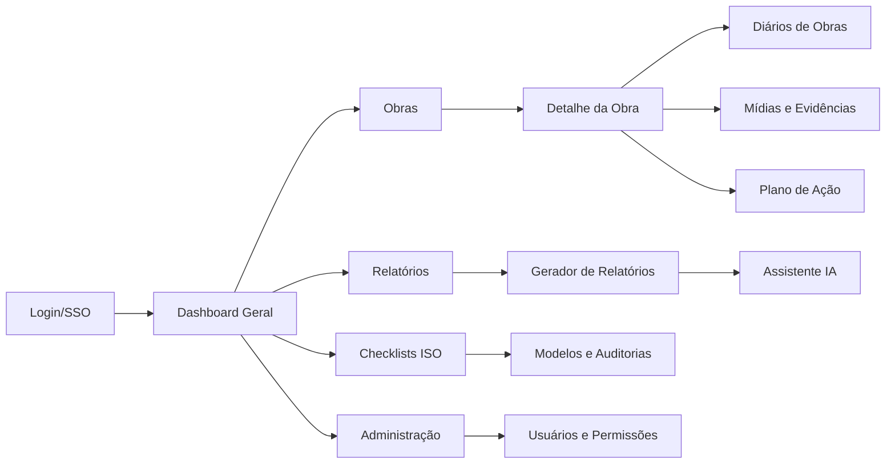
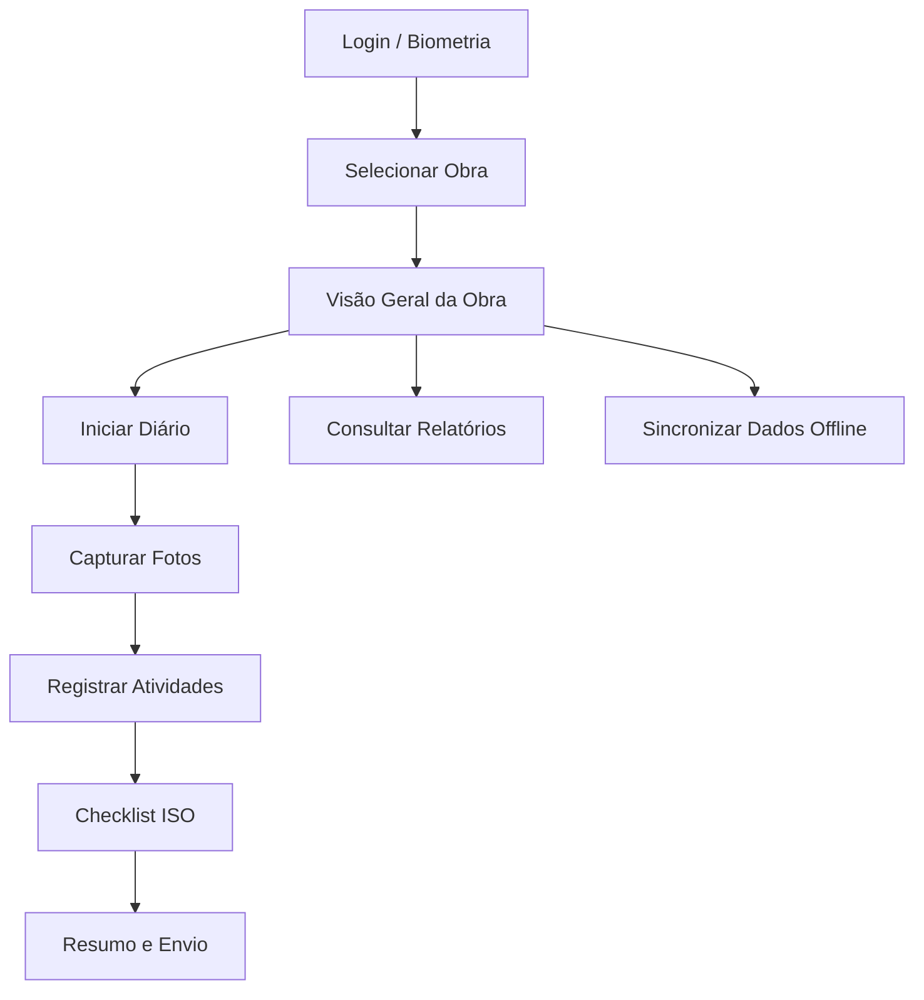

# Wireframes e Fluxos UX

## Visão Geral
Este documento descreve a arquitetura de navegação e os wireframes de alto nível para as experiências web e mobile do HUB Fiscalização. O objetivo é alinhar o time de produto, design e engenharia quanto ao comportamento esperado do MVP antes da prototipação visual detalhada.

## Princípios de Design
- **Clareza operacional**: destacar status de obras, pendências e próximos passos.
- **Registro rápido em campo**: reduzir toques necessários para registrar medições, fotos e anotações.
- **Conformidade orientada**: guiar o usuário para cumprir checklists e evidências ISO 9001.
- **Consistência cross-platform**: manter estrutura de informação equivalente no web e mobile, adaptando o layout ao contexto de uso.

---

## Portal Web (Desktop/Responsive)

### Mapa de Navegação


### Wireframes de Páginas-Chave

#### 1. Dashboard Geral
```
+----------------------------------------------------------------------------------+
| Header: Logo | Obra atual (dropdown) | Botões rápidos (Novo relatório, Upload)    |
+----------------------------------------------------------------------------------+
| KPIs (cards): Obras ativas | Relatórios pendentes | Não conformidades | Alertas    |
+----------------------------------------------------------------------------------+
| Linha do tempo: Próximas inspeções / entregas                                     |
+----------------------------------------------------------------------------------+
| Lista (2 colunas): Últimos diários enviados | Últimas fotos recebidas             |
+----------------------------------------------------------------------------------+
```

#### 2. Lista de Obras
```
+-----------------------------------------------------------+
| Filtro lateral: status, região, responsável, período       |
+-----------------------------------------------------------+
| Tabela responsiva com colunas: Nome, Cliente, Etapa,       |
| Responsável, Próxima visita, Ações (Ver detalhes)          |
+-----------------------------------------------------------+
```

#### 3. Detalhe da Obra
```
+----------------------------------------------------------------------------------+
| Header com breadcrumbs e botões: Criar diário | Upload mídia | Exportar          |
+----------------------------------------------------------------------------------+
| Tabs: Visão Geral | Diários | Mídias | Plano de Ação | Documentos              |
+----------------------------------------------------------------------------------+
| Conteúdo (Visão Geral):                                                             |
| - Painel lateral: Equipe, contatos, checklist ISO com status                       |
| - Corpo principal: Cards de avanço físico, gráfico de cronograma, feed de eventos   |
+----------------------------------------------------------------------------------+
```

#### 4. Gerador de Relatórios
```
+----------------------------------------------------------------------------------+
| Layout 3 colunas:                                                                   |
| - Esquerda: Biblioteca de blocos (Texto padrão, Fotos, Tabela, Checklist)          |
| - Centro: Canvas do relatório com seções arrastáveis                               |
| - Direita: Painel de propriedades (metadados, status ISO, sugestões IA)            |
+----------------------------------------------------------------------------------+
| Rodapé fixo: Botões de Salvar rascunho | Enviar p/ aprovação | Exportar PDF        |
+----------------------------------------------------------------------------------+
```

#### 5. Módulo ISO e Admin
```
+-----------------------------------------------------------+
| Seletor de procedimento ISO (dropdown)                    |
+-----------------------------------------------------------+
| Cards de checklists com status e botão "Editar"          |
+-----------------------------------------------------------+
| Tabela de auditorias: Data, Auditor, Resultado, Ações     |
+-----------------------------------------------------------+
```

---

## Aplicativo Mobile (iOS/Android)

### Fluxo Principal


### Wireframes de Telas-Chave

#### 1. Login e Seleção de Obra
```
Tela Login:
---------------------------------
| Logo                            |
| Campos: E-mail | Senha         |
| Botões: Entrar | SSO | Offline |
| Link: Esqueci minha senha       |
---------------------------------

Tela Seleção de Obra:
---------------------------------
| Busca | Filtros                 |
| Lista cartões: Nome, etapa,     |
| cidade, próxima visita          |
| CTA: Baixar para offline        |
---------------------------------
```

#### 2. Visão Geral da Obra (Mobile)
```
---------------------------------
| Header: Nome da obra | status   |
| Tabs: Diário | Fotos | Plano    |
| Widget de progresso (circular)  |
| Próximas atividades (cards)     |
| Botões rápidos: Novo diário,    |
| Capturar foto, Sincronizar      |
---------------------------------
```

#### 3. Criação de Diário de Obra
```
Passo 1 - Dados gerais:
---------------------------------
| Campos: Data, Equipe, Clima     |
| Dropdown fase/atividade         |
| Botão Próximo                   |
---------------------------------

Passo 2 - Fotos:
---------------------------------
| Grid placeholders 2x2           |
| Botão Capturar (camera nativa)  |
| Indicador GPS/hora automática   |
---------------------------------

Passo 3 - Atividades:
---------------------------------
| Campo texto (auto IA)           |
| Botões chips: Conclusão, Pendências |
| Adicionar medições (número + unidade) |
---------------------------------

Passo 4 - Checklist ISO:
---------------------------------
| Lista de itens com toggles e    |
| campo observações               |
---------------------------------

Passo 5 - Resumo:
---------------------------------
| Card consolidado (fotos, texto) |
| Botões: Salvar offline, Enviar  |
---------------------------------
```

#### 4. Captura de Mídia e Anotações
```
Tela Câmera:
---------------------------------
| Preview em tela cheia           |
| Overlays: GPS, data/hora, obra  |
| Botões: Capturar, Galeria, IA   |
---------------------------------

Tela Anotações por Voz:
---------------------------------
| Waveform ao centro              |
| Botões: Gravar, Pausar, Salvar  |
| Transcrição automática (textarea)
---------------------------------
```

### Estados Offline & Sincronização
- Banner persistente quando estiver offline com botão "Sincronizar".
- Indicadores por registro (ícone nuvem) para status: pendente, sincronizado, erro.
- Tela dedicada de sincronização exibindo fila de envios, conflitos e opção de priorizar diário crítico.

---

## Interações com o Assistente de IA
- **Web**: painel lateral no gerador de relatórios com sugestões contextualizadas, arrastar e soltar texto sugerido.
- **Mobile**: botões "Sugestão IA" em campos de texto e resumo final; respostas apresentadas como cartões editáveis antes de inserir no relatório.
- Logs de uso armazenados no backend com referência à obra, etapa e usuário para auditoria.

---

## Próximos Passos de Design
1. Criar protótipos de baixa fidelidade no Figma seguindo esta estrutura.
2. Validar fluxo com engenheiros e fiscais internos para ajustes de terminologia.
3. Definir componentes UI e tokens de design compartilhados entre web e mobile.
4. Planejar testes de usabilidade focando fluxo de diário completo e conformidade ISO.
